# 🚀 FLUJO DE OPTIMIZACIÓN FRONTEND - Edificio Admin

**Fecha:** 23 de Noviembre 2025  
**Objetivo:** Optimizar frontend con ejecución paralela de tareas

---

## 📋 ÍNDICE

1. [Análisis Actual](#análisis-actual)
2. [Arquitectura Propuesta](#arquitectura-propuesta)
3. [Fases de Ejecución](#fases-de-ejecución)
4. [Tareas Paralelas](#tareas-paralelas)
5. [Implementación](#implementación)
6. [Métricas y Monitoreo](#métricas-y-monitoreo)

---

## 🔍 ANÁLISIS ACTUAL

### Estructura Existente

```
public/
├── admin.html (859 líneas)
├── inquilino.html (259 líneas)
├── index.html (121 líneas)
├── css/
│   ├── styles.css
│   └── dashboard.css
└── js/
    ├── auth/
    │   └── auth.js
    ├── components/
    │   ├── admin-buttons.js ⭐ NUEVO
    │   ├── modal-handlers.js
    │   ├── navigation.js
    │   └── button-fix.js
    ├── modules/
    │   ├── cuotas/cuotas.js
    │   ├── gastos/gastos.js
    │   ├── fondos/fondos.js
    │   └── inquilino/
    │       ├── inquilino.js
    │       └── inquilino-buttons.js ⭐ NUEVO
    └── utils/
        └── utils.js
```

### Problemas Identificados

1. **Carga Secuencial:** Scripts se cargan uno tras otro
2. **Código Duplicado:** Lógica repetida en múltiples archivos
3. **Sin Lazy Loading:** Todo se carga al inicio
4. **Sin Caché:** Llamadas API repetidas
5. **Sin Minificación:** Archivos sin comprimir
6. **Sin Bundling:** Múltiples requests HTTP

---

## 🏗️ ARQUITECTURA PROPUESTA

### Modelo de Carga Optimizado

```mermaid
graph TD
    A[Carga Inicial] --> B[Core Critical]
    A --> C[Módulos Async]
    A --> D[Recursos Estáticos]
    
    B --> B1[Auth]
    B --> B2[Navigation]
    B --> B3[API Client]
    
    C --> C1[Módulo Cuotas]
    C --> C2[Módulo Gastos]
    C --> C3[Módulo Fondos]
    C --> C4[Módulo Anuncios]
    
    D --> D1[CSS]
    D --> D2[Imágenes]
    D --> D3[Fonts]
    
    B1 -.->|Lazy Load| C1
    B1 -.->|Lazy Load| C2
    B1 -.->|Lazy Load| C3
```



### Capas de Optimización

```
┌─────────────────────────────────────────────┐
│  CAPA 1: Critical Path (Inline/Preload)    │
│  - Auth básico                               │
│  - CSS crítico                               │
│  - API client                                │
└─────────────────────────────────────────────┘
           ↓
┌─────────────────────────────────────────────┐
│  CAPA 2: Módulos Core (Defer/Async)        │
│  - Navigation                                │
│  - Event handlers globales                   │
│  - Utils comunes                             │
└─────────────────────────────────────────────┘
           ↓
┌─────────────────────────────────────────────┐
│  CAPA 3: Módulos Específicos (Lazy)        │
│  - Cuotas (solo si se accede)               │
│  - Gastos (solo si se accede)               │
│  - Fondos (solo si se accede)               │
└─────────────────────────────────────────────┘
           ↓
┌─────────────────────────────────────────────┐
│  CAPA 4: Recursos No Críticos (Idle)       │
│  - Chart.js                                  │
│  - Componentes avanzados                     │
│  - Analytics                                 │
└─────────────────────────────────────────────┘
```

---

## 📊 FASES DE EJECUCIÓN

### **FASE 0: Preparación** (1 hora)

**Objetivo:** Configurar herramientas y ambiente

#### Tareas Paralelas:

```bash
# Terminal 1: Instalar dependencias build
npm install --save-dev \
  esbuild \
  terser \
  postcss \
  cssnano \
  autoprefixer

# Terminal 2: Crear estructura directorios
mkdir -p dist/{css,js} \
         src-optimized/{core,modules,utils} \
         build-scripts

# Terminal 3: Backup de archivos actuales
tar -czf backup-pre-optimization.tar.gz public/
```

---

### **FASE 1: Análisis y Auditoría** (30 min)

**Objetivo:** Identificar qué optimizar primero

#### Grupo A: Análisis de Performance

```bash
# Terminal 1: Lighthouse audit
npx lighthouse http://localhost:3000/admin.html \
  --output=json \
  --output-path=./docs/lighthouse-before.json

# Terminal 2: Bundle analyzer
npx source-map-explorer public/js/**/*.js \
  --html docs/bundle-analysis.html

# Terminal 3: Análisis de cobertura de código
# (Usar Chrome DevTools Coverage)
```

#### Grupo B: Análisis de Dependencias

```bash
# Terminal 1: Análisis de imports/exports
grep -r "import\|require" public/js/ > docs/dependencies-map.txt

# Terminal 2: Detectar código no usado
npx eslint public/js/ --ext .js --report-unused-disable-directives

# Terminal 3: Análisis de duplicación
npx jscpd public/js/ --format "javascript" --output docs/
```

**Entregables:**
- `lighthouse-before.json`
- `bundle-analysis.html`
- `dependencies-map.txt`
- Reporte de código duplicado

---

### **FASE 2: Refactorización Estructural** (2 horas)

**Objetivo:** Reorganizar código para carga óptima

#### Grupo A: Módulos Core (Paralelo)

**Persona 1:** API Client Centralizado
```javascript
// src-optimized/core/api-client.js
class APIClient {
  constructor() {
    this.baseURL = '/api';
    this.cache = new Map();
    this.requestQueue = [];
  }

  async request(endpoint, options = {}) {
    const cacheKey = `${options.method || 'GET'}:${endpoint}`;
    
    // Cache check
    if (this.cache.has(cacheKey) && !options.nocache) {
      return this.cache.get(cacheKey);
    }

    // Request deduplication
    const pending = this.requestQueue.find(r => r.key === cacheKey);
    if (pending) return pending.promise;

    // New request
    const promise = this._fetch(endpoint, options);
    this.requestQueue.push({ key: cacheKey, promise });

    const result = await promise;
    this.cache.set(cacheKey, result);
    
    return result;
  }

  async _fetch(endpoint, options) {
    const token = localStorage.getItem('edificio_token');
    const response = await fetch(`${this.baseURL}${endpoint}`, {
      ...options,
      headers: {
        'Content-Type': 'application/json',
        'x-auth-token': token,
        ...options.headers
      }
    });

    if (!response.ok) throw new Error(`API Error: ${response.status}`);
    return response.json();
  }

  // Prefetch común
  async prefetchCommon() {
    await Promise.all([
      this.request('/fondos'),
      this.request('/cuotas?limit=10'),
      this.request('/anuncios?limit=5')
    ]);
  }

  clearCache() {
    this.cache.clear();
  }
}

export default new APIClient();
```

**Persona 2:** State Manager Global
```javascript
// src-optimized/core/state-manager.js
class StateManager {
  constructor() {
    this.state = {
      user: null,
      cuotas: [],
      gastos: [],
      fondos: [],
      anuncios: [],
      loading: {},
      errors: {}
    };
    this.listeners = new Map();
  }

  get(key) {
    return this.state[key];
  }

  set(key, value) {
    this.state[key] = value;
    this.notify(key, value);
  }

  subscribe(key, callback) {
    if (!this.listeners.has(key)) {
      this.listeners.set(key, new Set());
    }
    this.listeners.get(key).add(callback);

    // Retornar función de unsuscribe
    return () => {
      this.listeners.get(key).delete(callback);
    };
  }

  notify(key, value) {
    if (this.listeners.has(key)) {
      this.listeners.get(key).forEach(callback => callback(value));
    }
  }

  setLoading(key, isLoading) {
    this.state.loading[key] = isLoading;
    this.notify('loading', this.state.loading);
  }

  setError(key, error) {
    this.state.errors[key] = error;
    this.notify('errors', this.state.errors);
  }
}

export default new StateManager();
```

**Persona 3:** Module Loader Dinámico
```javascript
// src-optimized/core/module-loader.js
class ModuleLoader {
  constructor() {
    this.modules = new Map();
    this.loading = new Map();
  }

  async load(moduleName) {
    // Ya cargado
    if (this.modules.has(moduleName)) {
      return this.modules.get(moduleName);
    }

    // Ya está cargando
    if (this.loading.has(moduleName)) {
      return this.loading.get(moduleName);
    }

    // Cargar nuevo módulo
    const loadPromise = this._loadModule(moduleName);
    this.loading.set(moduleName, loadPromise);

    try {
      const module = await loadPromise;
      this.modules.set(moduleName, module);
      this.loading.delete(moduleName);
      return module;
    } catch (error) {
      this.loading.delete(moduleName);
      throw error;
    }
  }

  async _loadModule(moduleName) {
    const moduleMap = {
      'cuotas': () => import('./modules/cuotas-optimized.js'),
      'gastos': () => import('./modules/gastos-optimized.js'),
      'fondos': () => import('./modules/fondos-optimized.js'),
      'anuncios': () => import('./modules/anuncios-optimized.js'),
      'cierres': () => import('./modules/cierres-optimized.js')
    };

    if (!moduleMap[moduleName]) {
      throw new Error(`Module ${moduleName} not found`);
    }

    const module = await moduleMap[moduleName]();
    
    // Inicializar módulo si tiene init
    if (module.default?.init) {
      await module.default.init();
    }

    return module.default;
  }

  preload(moduleNames) {
    return Promise.all(
      moduleNames.map(name => this.load(name))
    );
  }

  unload(moduleName) {
    if (this.modules.has(moduleName)) {
      const module = this.modules.get(moduleName);
      if (module.cleanup) {
        module.cleanup();
      }
      this.modules.delete(moduleName);
    }
  }
}

export default new ModuleLoader();
```

#### Grupo B: Optimización de Módulos Existentes (Paralelo)

**Persona 1:** Optimizar Cuotas
```javascript
// src-optimized/modules/cuotas-optimized.js
import APIClient from '../core/api-client.js';
import State from '../core/state-manager.js';

class CuotasModule {
  constructor() {
    this.initialized = false;
    this.filters = { mes: '', anio: '', estado: 'TODOS' };
  }

  async init() {
    if (this.initialized) return;
    
    this.setupEventListeners();
    await this.loadData();
    this.initialized = true;
  }

  async loadData() {
    State.setLoading('cuotas', true);
    
    try {
      const params = new URLSearchParams();
      if (this.filters.mes) params.append('mes', this.filters.mes);
      if (this.filters.anio) params.append('anio', this.filters.anio);
      if (this.filters.estado !== 'TODOS') params.append('estado', this.filters.estado);

      const data = await APIClient.request(`/cuotas?${params}`);
      State.set('cuotas', data.cuotas || []);
    } catch (error) {
      State.setError('cuotas', error.message);
    } finally {
      State.setLoading('cuotas', false);
    }
  }

  setupEventListeners() {
    // Event delegation
    document.addEventListener('click', this.handleClick.bind(this));
    document.addEventListener('change', this.handleChange.bind(this));

    // Subscribe to state changes
    State.subscribe('cuotas', this.render.bind(this));
  }

  handleClick(e) {
    const target = e.target;
    
    if (target.id === 'nueva-cuota-btn') {
      this.showModal();
    } else if (target.closest('[data-action="validar"]')) {
      const id = target.closest('[data-action="validar"]').dataset.id;
      this.validarCuota(id);
    }
  }

  handleChange(e) {
    const target = e.target;
    
    if (['cuotas-mes', 'cuotas-año', 'cuotas-estado'].includes(target.id)) {
      this.updateFilters();
    }
  }

  updateFilters() {
    this.filters = {
      mes: document.getElementById('cuotas-mes')?.value || '',
      anio: document.getElementById('cuotas-año')?.value || '',
      estado: document.getElementById('cuotas-estado')?.value || 'TODOS'
    };
    this.loadData();
  }

  render(cuotas) {
    const tbody = document.querySelector('#cuotas-table tbody');
    if (!tbody) return;

    // Use DocumentFragment for better performance
    const fragment = document.createDocumentFragment();

    cuotas.forEach(cuota => {
      const tr = this.createCuotaRow(cuota);
      fragment.appendChild(tr);
    });

    tbody.innerHTML = '';
    tbody.appendChild(fragment);
  }

  createCuotaRow(cuota) {
    const tr = document.createElement('tr');
    tr.innerHTML = `
      <td>${cuota.departamento}</td>
      <td>${cuota.mes} ${cuota.anio}</td>
      <td>$${cuota.monto.toLocaleString()}</td>
      <td><span class="badge badge-${cuota.estado.toLowerCase()}">${cuota.estado}</span></td>
      <td>${new Date(cuota.fechaVencimiento).toLocaleDateString('es-MX')}</td>
      <td>${cuota.fechaPago ? new Date(cuota.fechaPago).toLocaleDateString('es-MX') : '-'}</td>
      <td>
        <button class="btn btn-sm" data-action="validar" data-id="${cuota.id}">
          Validar
        </button>
      </td>
    `;
    return tr;
  }

  showModal() {
    const modal = document.getElementById('cuota-modal');
    if (modal) modal.style.display = 'block';
  }

  async validarCuota(id) {
    // Implementation
  }

  cleanup() {
    // Remove event listeners if needed
    this.initialized = false;
  }
}

export default new CuotasModule();
```

**Persona 2:** Optimizar Gastos (similar estructura)

**Persona 3:** Optimizar Fondos (similar estructura)

---

### **FASE 3: Implementación de Lazy Loading** (1 hora)

**Objetivo:** Cargar módulos solo cuando se necesitan

#### Router con Lazy Loading

```javascript
// src-optimized/core/router.js
import ModuleLoader from './module-loader.js';

class Router {
  constructor() {
    this.routes = new Map();
    this.currentModule = null;
    this.setupNavigation();
  }

  register(path, moduleName) {
    this.routes.set(path, moduleName);
  }

  setupNavigation() {
    document.addEventListener('click', async (e) => {
      const link = e.target.closest('a[href^="#"]');
      if (!link) return;

      e.preventDefault();
      const path = link.getAttribute('href').substring(1);
      await this.navigate(path);
    });
  }

  async navigate(path) {
    // Mostrar loader
    this.showLoader();

    // Descargar módulo anterior
    if (this.currentModule) {
      ModuleLoader.unload(this.currentModule);
    }

    // Cargar nuevo módulo
    const moduleName = this.routes.get(path);
    if (moduleName) {
      try {
        await ModuleLoader.load(moduleName);
        this.currentModule = moduleName;
        this.showSection(path);
      } catch (error) {
        console.error('Error loading module:', error);
        this.showError(error);
      }
    }

    this.hideLoader();
  }

  showLoader() {
    document.body.classList.add('loading');
  }

  hideLoader() {
    document.body.classList.remove('loading');
  }

  showSection(sectionId) {
    document.querySelectorAll('.content-section').forEach(section => {
      section.style.display = 'none';
    });

    const targetSection = document.getElementById(`${sectionId}-section`);
    if (targetSection) {
      targetSection.style.display = 'block';
    }
  }

  showError(error) {
    alert(`Error cargando módulo: ${error.message}`);
  }
}

const router = new Router();

// Registrar rutas
router.register('cuotas', 'cuotas');
router.register('gastos', 'gastos');
router.register('fondos', 'fondos');
router.register('anuncios', 'anuncios');
router.register('cierres', 'cierres');

export default router;
```

---

### **FASE 4: Build y Minificación** (30 min)

**Objetivo:** Comprimir y optimizar archivos

#### Build Script con esbuild

```javascript
// build-scripts/build.js
import esbuild from 'esbuild';
import { minify } from 'terser';
import fs from 'fs/promises';

async function buildCore() {
  await esbuild.build({
    entryPoints: [
      'src-optimized/core/api-client.js',
      'src-optimized/core/state-manager.js',
      'src-optimized/core/module-loader.js',
      'src-optimized/core/router.js'
    ],
    bundle: true,
    minify: true,
    sourcemap: true,
    splitting: true,
    format: 'esm',
    outdir: 'dist/js/core',
    target: ['es2020']
  });
}

async function buildModules() {
  const modules = [
    'cuotas-optimized',
    'gastos-optimized',
    'fondos-optimized',
    'anuncios-optimized'
  ];

  await Promise.all(
    modules.map(module => 
      esbuild.build({
        entryPoints: [`src-optimized/modules/${module}.js`],
        bundle: true,
        minify: true,
        sourcemap: true,
        format: 'esm',
        outdir: 'dist/js/modules',
        target: ['es2020']
      })
    )
  );
}

async function buildCSS() {
  // Process CSS with PostCSS
  const postcss = (await import('postcss')).default;
  const cssnano = (await import('cssnano')).default;
  const autoprefixer = (await import('autoprefixer')).default;

  const css = await fs.readFile('public/css/styles.css', 'utf8');
  
  const result = await postcss([
    autoprefixer,
    cssnano
  ]).process(css, { from: 'public/css/styles.css' });

  await fs.writeFile('dist/css/styles.min.css', result.css);
  if (result.map) {
    await fs.writeFile('dist/css/styles.min.css.map', result.map.toString());
  }
}

async function buildAll() {
  console.log('🔨 Building frontend...');
  
  await Promise.all([
    buildCore(),
    buildModules(),
    buildCSS()
  ]);

  console.log('✅ Build complete!');
}

buildAll().catch(console.error);
```

#### Package.json Scripts

```json
{
  "scripts": {
    "build": "node build-scripts/build.js",
    "build:dev": "node build-scripts/build.js --dev",
    "build:watch": "node build-scripts/build.js --watch",
    "analyze": "node build-scripts/analyze.js",
    "optimize": "npm run analyze && npm run build"
  }
}
```

---

### **FASE 5: Implementación de Caché** (45 min)

**Objetivo:** Reducir llamadas API y mejorar tiempos de respuesta

#### Service Worker para Cache

```javascript
// public/service-worker.js
const CACHE_NAME = 'edificio-admin-v1';
const STATIC_CACHE = 'static-v1';
const API_CACHE = 'api-v1';

const STATIC_ASSETS = [
  '/',
  '/admin.html',
  '/inquilino.html',
  '/css/styles.min.css',
  '/js/core/api-client.js',
  '/js/core/state-manager.js',
  '/js/core/router.js'
];

// Install
self.addEventListener('install', (event) => {
  event.waitUntil(
    caches.open(STATIC_CACHE)
      .then(cache => cache.addAll(STATIC_ASSETS))
  );
  self.skipWaiting();
});

// Activate
self.addEventListener('activate', (event) => {
  event.waitUntil(
    caches.keys().then(keys => {
      return Promise.all(
        keys
          .filter(key => key !== STATIC_CACHE && key !== API_CACHE)
          .map(key => caches.delete(key))
      );
    })
  );
  self.clients.claim();
});

// Fetch
self.addEventListener('fetch', (event) => {
  const { request } = event;
  const url = new URL(request.url);

  // API requests - Network First
  if (url.pathname.startsWith('/api/')) {
    event.respondWith(
      fetch(request)
        .then(response => {
          const clone = response.clone();
          caches.open(API_CACHE).then(cache => {
            cache.put(request, clone);
          });
          return response;
        })
        .catch(() => {
          return caches.match(request);
        })
    );
    return;
  }

  // Static assets - Cache First
  event.respondWith(
    caches.match(request)
      .then(cached => cached || fetch(request))
  );
});
```

#### Registro de Service Worker

```javascript
// src-optimized/core/service-worker-register.js
export async function registerServiceWorker() {
  if ('serviceWorker' in navigator) {
    try {
      const registration = await navigator.serviceWorker.register('/service-worker.js');
      console.log('✅ Service Worker registrado:', registration.scope);

      // Check for updates
      registration.addEventListener('updatefound', () => {
        const newWorker = registration.installing;
        newWorker.addEventListener('statechange', () => {
          if (newWorker.state === 'installed' && navigator.serviceWorker.controller) {
            // New version available
            if (confirm('Nueva versión disponible. ¿Recargar?')) {
              window.location.reload();
            }
          }
        });
      });
    } catch (error) {
      console.error('❌ Error registrando Service Worker:', error);
    }
  }
}
```

---

### **FASE 6: HTML Optimizado** (30 min)

**Objetivo:** Optimizar carga inicial de HTML

#### Admin.html Optimizado

```html
<!DOCTYPE html>
<html lang="es">
<head>
  <meta charset="UTF-8">
  <meta name="viewport" content="width=device-width, initial-scale=1.0">
  <title>Edificio-Admin | Panel de Administración</title>
  
  <!-- Preconnect to API -->
  <link rel="preconnect" href="/api">
  
  <!-- Critical CSS inline -->
  <style>
    /* Critical path CSS - Solo lo necesario para first paint */
    body { margin: 0; font-family: system-ui, -apple-system, sans-serif; }
    .loading { opacity: 0.5; pointer-events: none; }
    .sidebar { width: 250px; height: 100vh; background: #2c3e50; }
    .main-content { flex: 1; padding: 20px; }
    /* ... más CSS crítico ... */
  </style>
  
  <!-- Preload critical resources -->
  <link rel="preload" href="/dist/js/core/api-client.js" as="script">
  <link rel="preload" href="/dist/js/core/state-manager.js" as="script">
  <link rel="preload" href="/dist/css/styles.min.css" as="style">
  
  <!-- Non-critical CSS -->
  <link rel="stylesheet" href="/dist/css/styles.min.css" media="print" onload="this.media='all'">
  <noscript><link rel="stylesheet" href="/dist/css/styles.min.css"></noscript>
  
  <!-- Prefetch likely next modules -->
  <link rel="prefetch" href="/dist/js/modules/cuotas-optimized.js">
  <link rel="prefetch" href="/dist/js/modules/gastos-optimized.js">
</head>
<body>
  <!-- Skeleton loader -->
  <div id="app-skeleton" class="skeleton">
    <div class="skeleton-sidebar"></div>
    <div class="skeleton-content"></div>
  </div>

  <!-- App container -->
  <div id="app" style="display:none">
    <aside class="sidebar">
      <!-- Sidebar content -->
    </aside>
    
    <main class="main-content">
      <!-- Dynamic content -->
    </main>
  </div>

  <!-- Core scripts - ES Modules -->
  <script type="module">
    import APIClient from '/dist/js/core/api-client.js';
    import State from '/dist/js/core/state-manager.js';
    import Router from '/dist/js/core/router.js';
    import { registerServiceWorker } from '/dist/js/core/service-worker-register.js';

    // Initialize
    (async () => {
      // Register service worker
      await registerServiceWorker();

      // Check auth
      const user = await APIClient.request('/auth/verify');
      State.set('user', user);

      // Hide skeleton, show app
      document.getElementById('app-skeleton').style.display = 'none';
      document.getElementById('app').style.display = 'flex';

      // Prefetch common data
      APIClient.prefetchCommon();

      // Initialize router
      Router.navigate('cuotas'); // Default route
    })();
  </script>

  <!-- Non-critical external scripts -->
  <script src="https://cdn.jsdelivr.net/npm/chart.js" defer></script>
</body>
</html>
```

---

## 📊 MÉTRICAS Y MONITOREO

### KPIs a Medir

#### Antes de Optimización
```yaml
First Contentful Paint (FCP): ~2.5s
Time to Interactive (TTI): ~4.2s
Largest Contentful Paint (LCP): ~3.8s
Total Blocking Time (TBT): ~850ms
Cumulative Layout Shift (CLS): 0.15
Bundle Size: ~420KB
Requests: 18
```

#### Después de Optimización (Objetivo)
```yaml
First Contentful Paint (FCP): <1.2s ⬇️ 52%
Time to Interactive (TTI): <2.0s ⬇️ 52%
Largest Contentful Paint (LCP): <1.8s ⬇️ 53%
Total Blocking Time (TBT): <200ms ⬇️ 76%
Cumulative Layout Shift (CLS): <0.05 ⬇️ 67%
Bundle Size: <180KB ⬇️ 57%
Requests: 8 ⬇️ 56%
```

### Herramientas de Monitoreo

```javascript
// src-optimized/core/performance-monitor.js
class PerformanceMonitor {
  constructor() {
    this.metrics = {};
  }

  mark(name) {
    performance.mark(name);
  }

  measure(name, startMark, endMark) {
    try {
      performance.measure(name, startMark, endMark);
      const measure = performance.getEntriesByName(name)[0];
      this.metrics[name] = measure.duration;
      return measure.duration;
    } catch (error) {
      console.error('Performance measure error:', error);
    }
  }

  reportWebVitals() {
    // FCP
    const fcp = performance.getEntriesByName('first-contentful-paint')[0];
    
    // LCP
    new PerformanceObserver((list) => {
      const entries = list.getEntries();
      const lastEntry = entries[entries.length - 1];
      console.log('LCP:', lastEntry.renderTime || lastEntry.loadTime);
    }).observe({ entryTypes: ['largest-contentful-paint'] });

    // CLS
    let clsScore = 0;
    new PerformanceObserver((list) => {
      for (const entry of list.getEntries()) {
        if (!entry.hadRecentInput) {
          clsScore += entry.value;
        }
      }
      console.log('CLS:', clsScore);
    }).observe({ entryTypes: ['layout-shift'] });

    // FID
    new PerformanceObserver((list) => {
      const firstInput = list.getEntries()[0];
      const fid = firstInput.processingStart - firstInput.startTime;
      console.log('FID:', fid);
    }).observe({ entryTypes: ['first-input'] });

    return {
      fcp: fcp?.startTime,
      cls: clsScore,
      metrics: this.metrics
    };
  }

  sendToAnalytics(data) {
    // Send to backend or analytics service
    fetch('/api/analytics/performance', {
      method: 'POST',
      headers: { 'Content-Type': 'application/json' },
      body: JSON.stringify(data)
    });
  }
}

export default new PerformanceMonitor();
```

---

## 🎯 CHECKLIST DE IMPLEMENTACIÓN

### Pre-optimización
- [ ] Backup completo del proyecto
- [ ] Crear branch `feature/frontend-optimization`
- [ ] Instalar dependencias de build
- [ ] Configurar herramientas de análisis
- [ ] Ejecutar Lighthouse baseline

### Core
- [ ] API Client centralizado
- [ ] State Manager global
- [ ] Module Loader dinámico
- [ ] Router con lazy loading
- [ ] Service Worker para cache

### Módulos
- [ ] Refactorizar módulo Cuotas
- [ ] Refactorizar módulo Gastos
- [ ] Refactorizar módulo Fondos
- [ ] Refactorizar módulo Anuncios
- [ ] Refactorizar módulo Cierres

### Build
- [ ] Configurar esbuild
- [ ] Scripts de minificación
- [ ] Optimización de CSS
- [ ] Generación de sourcemaps
- [ ] CI/CD pipeline

### Testing
- [ ] Tests de carga
- [ ] Tests de performance
- [ ] Tests de compatibilidad
- [ ] Validación cross-browser
- [ ] Mobile responsiveness

### Deployment
- [ ] Build de producción
- [ ] Caché headers configurados
- [ ] CDN setup (opcional)
- [ ] Monitoring activo
- [ ] Rollback plan

---

## 🚀 COMANDOS RÁPIDOS

```bash
# Análisis inicial
npm run analyze

# Build desarrollo (sin minificar)
npm run build:dev

# Build producción
npm run build

# Build con watch (desarrollo continuo)
npm run build:watch

# Lighthouse audit
npm run lighthouse

# Servir versión optimizada
npm run serve:dist
```

---

## 📈 ROADMAP DE OPTIMIZACIÓN

### Semana 1: Fundamentos
- Días 1-2: Análisis y setup
- Días 3-4: Core modules
- Día 5: Lazy loading

### Semana 2: Refinamiento
- Días 1-2: Build pipeline
- Días 3-4: Service Worker y caché
- Día 5: Testing y ajustes

### Semana 3: Producción
- Días 1-2: HTML optimizado
- Días 3-4: Performance tuning
- Día 5: Deploy y monitoreo

---

## 💡 TIPS Y MEJORES PRÁCTICAS

### Code Splitting
```javascript
// ✅ Bueno: Dynamic import
button.addEventListener('click', async () => {
  const module = await import('./heavy-module.js');
  module.default.run();
});

// ❌ Malo: Import estático de módulo pesado
import HeavyModule from './heavy-module.js';
```

### Event Delegation
```javascript
// ✅ Bueno: Un listener para todos
document.addEventListener('click', (e) => {
  if (e.target.matches('.btn-delete')) {
    handleDelete(e.target.dataset.id);
  }
});

// ❌ Malo: Un listener por elemento
document.querySelectorAll('.btn-delete').forEach(btn => {
  btn.addEventListener('click', handleDelete);
});
```

### Debounce en Filtros
```javascript
// ✅ Bueno: Debounce para evitar requests excesivos
const debouncedFilter = debounce(() => {
  loadCuotas();
}, 300);

filterInput.addEventListener('input', debouncedFilter);
```

### Virtual Scrolling para Listas Grandes
```javascript
// Para listas con 100+ items
class VirtualList {
  constructor(container, items, rowHeight) {
    this.container = container;
    this.items = items;
    this.rowHeight = rowHeight;
    this.visibleRows = Math.ceil(container.clientHeight / rowHeight);
    this.render();
  }

  render() {
    const scrollTop = this.container.scrollTop;
    const startIndex = Math.floor(scrollTop / this.rowHeight);
    const endIndex = startIndex + this.visibleRows;

    // Solo renderizar items visibles
    const visibleItems = this.items.slice(startIndex, endIndex);
    this.container.innerHTML = visibleItems.map(this.renderItem).join('');
  }
}
```

---

## 🔧 TROUBLESHOOTING

### Problema: Módulos no se cargan
```javascript
// Verificar en console
console.log('Module Loader:', window.ModuleLoader);
console.log('Loaded modules:', window.ModuleLoader.modules);
```

### Problema: Service Worker no actualiza
```javascript
// Forzar actualización
navigator.serviceWorker.getRegistrations().then(registrations => {
  registrations.forEach(reg => reg.unregister());
});
```

### Problema: Cache desactualizado
```javascript
// Limpiar cache
caches.keys().then(keys => {
  keys.forEach(key => caches.delete(key));
});
```

---

**Generado por Crush**  
_Sistema de optimización frontend automática_
